# Medic-Chain:

Medic-Chain is a **Block Chain based Flutter Mobile Application** commonly known as **Decentralized Mobile App (DAPP)**. Our application helps to securely store and retrieve patient records by leveraging the power of Block Chain.

## Steps to execute the Project:

1. Install Flutter using the [Flutter installation Guide](https://flutter.dev/docs/get-started/install/windows).
2. Clone this repository using the command:

```git
git clone https://github.com/EashwarPrabu/Medic-Chain.git
```

3. Open the project in Android Studio and create a `.env` file in the root folder.
4. The contents of the **_.env_** file must include:

```
API=<INFURA_API_KEY>
CONTRACT_ADDRESS=<DEPLOYED_CONTRACT_ADDRESS>
CREDENTIAL=<METAMASK_ACCOUNT_CREDENTIALS>
```

-   The **API** key can be obtained from the [Infura API](https://infura.io/) website.
-   Deploy the Solidity contract present in the **_Block Chain_** folder of this Repo onto the [Remix IDE](https://remix.ethereum.org/) and get access to the **Contract Address**
-   Download the [MetaMask Chrome Extension](https://metamask.io/download.html), create an account, select the Rinkeby Test Network and copy the **Private key of your account**.

5. Run the Project!

# Deep Dive into Medic-Chain:

## Block Chain:

A Block chain is a **decentralized, continuously growing online ledger of
records**, validated by members of the network. Each block contains a **hash of the previous block, a timestamp, and transaction data**. Blocks contain the hash of the previous block, thus forming a chain, with each blocks reinforcing the ones before it. Therefore, block chains are resistant to modification of their data because once recorded, the data in any given block cannot be altered without altering all subsequent blocks.

## Block Chain to store Medical Records:

**Electronic Health Record (EHR)** systems are used as an effective method to store patients' records by different hospitals. However, it is still a challenge to access scattered patient data through multiple EHR’s. **Block chain is great for creating a single patient registry**. Our goal is to build a mobile application to access patient records easily with the help of a **Ethereum Block Chain**.

## Implementation:

The **Smart Contracts** was written using the **Solidity Programming language** and this is deployed in the **Rinkeby Test Network** of the Ethereum Block Chain. The reason for choosing Ethereum which is a Public Block Chain is these medical records needs to accessed by various hospitals and hence must be distributed. The Mobile Application has been developed using **Flutter**, a cross platform mobile app development framework created by **Google.**

## External Packages and API's Used:

-   [Web3Dart](https://pub.dev/packages/web3dart) - Used to connect with the Ethereum Block Chain. It connects to an Ethereum Node to send transactions and interact with the deployed Smart Contracts.
-   [Dot Env](https://pub.dev/packages/dotenv) - Used to load credentials at runtime from the .env file.
-   [Infura API](https://infura.io/) - Provides instant access to Ethereum networks.

## Modules:

#### The project involves 3 important modules. They are:

1. [Block Chain Module](#block-chain-module)
2. [Block Chain Updation Module](#block-chain-updation-module)
3. [Front End Module](#front-end-module)

### Block Chain Module:

The Smart Contract was developed using an Online IDE called [Remix Editor](https://remix.ethereum.org/). This editor not only allows us to quickly develop Smart Contracts but also has several handy features to **compile and deploy** the Smart Contracts. Our Smart Contract was deployed in the **Rinkeby Test Network of the Ethereum Block Chain**. A smart contract is a computer program which automatically executes and controls according to the terms of a contract or an agreement. Its objectives is to reduce the need for trusted inter-mediators, enforcement cost as well as the reduction of malicious and accidental exceptions.

Our Smart Contract will be able to store details of any number of patients. Each patient will be required to provide his ID (Phone no / Aadhar No) to uniquely identify and retrieve his records from the Block Chain.

On compiling the Smart Contract, we get 2 different output files namely, the **abi.json** and the **Byte Code**. The Byte Code gets deployed in the Block Chain. The abi.json file helps the developers to easily interact with their Smart Contract from 3rd party frameworks like Flutter (for Mobile Apps) or React JS (for Web Apps).

### The 2 important terminologies related to Smart Contracts are:

-   **Transaction** - A function call to the Smart Contract is called a Transaction, if it involves creation or updation of data in our Smart Contract. As the name suggests, this required some amount of Ether to be paid for the miners in the Block Chain. In our case, imaginary Ether coins is being used in the transaction.

-   **Call** - A function call to the Smart Contract is called a Call, if it just retrieves the values that are present in the Smart Contract without updating any of its fields. This doesn't require any amount of Ether to be paid. It is just like a normal function call present in other programming language.

### Block Chain Updation Module:

This module takes care of the **communication** that needs to be done
between the **Flutter Mobile App and the Block Chain** for the transfer and storage of data. This is where the **Web3Dart** package comes in handy. In order to establish a successful communication between the Mobile App and the Smart Contract hosted in Rinkeby Test Network, the following 4 parameters are required:

1. The **Infura API** to get quick access to the Rinkeby Test Network.
2. The actual **address of our Deployed Smart Contract** (in Rinkeby Network) to get access to our contract using which we can access all the function present in it.
3. The **abi.json** file which is obtained from compiling the Smart Contract.
4. An **account's Private key** has to be provided to pay for all the transaction that will be taking place.

All the **Setter functions** are executed using the **[Transaction](#the-2-important-terminologies-related-to-smart-contracts-are)** methodology meaning they require us to pay a certain amount of Ethereum coin whereas all the **Getter functions** are executing using the [**Call**](#the-2-important-terminologies-related-to-smart-contracts-are) methodology where we need not pay any amount as we aren't updating the contract.

### Front End Module:

The Flutter Mobile Application consists of all the necessary **forms** to get
the user inputs. All these user inputs are being validated with the help of **Validators**. Once these inputs that are obtained from the user are validated it will be passed on to the Block Chain updation module for further processing **(Storage and Retrieval)**. We will be having 4 forms. They are:

1. To add **_patient's personal details_**.
2. To add **_patient's medical details_**.
3. To add **_patient's medical history_**.

    These three pages have several **text fields with icons, check boxes and
    radio buttons to obtain values**. In addition to these, they also have validators for checking the input obtained from the **Doctor**. (It is assumed only the Doctor creates or updates the patient record while both the Doctor or the Patient can retrieve and view the records.)

4. To enter **_patient's ID and view his entire medical record_**. This page uses **List View** widget to dynamically update the page based on the number of records present in the Patient's data.

## Screen Shots:

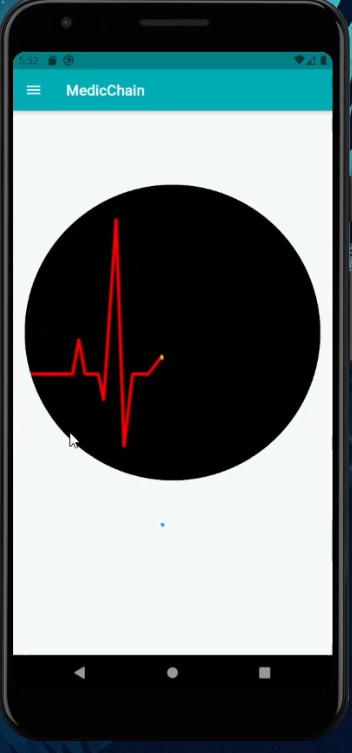

> Loading Animation

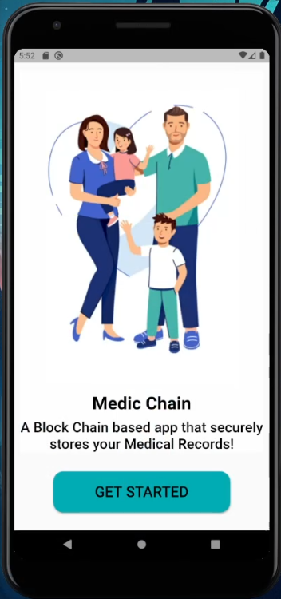

> Home Screen

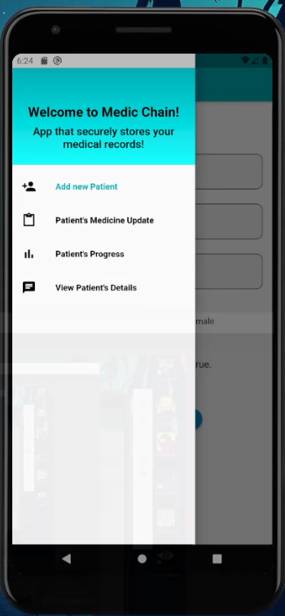

> App Drawer

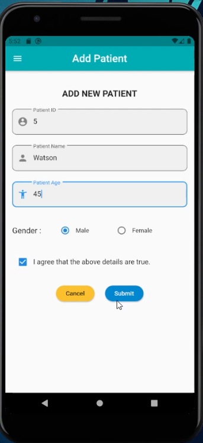

> Form to Add Patient Details

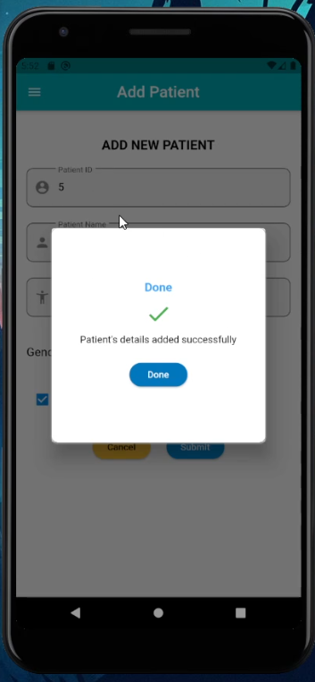

> Success Dialog Box

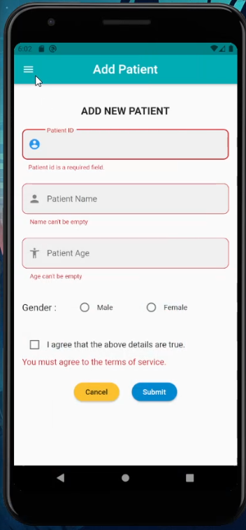

> Errors shown by Validators if wrong input is given

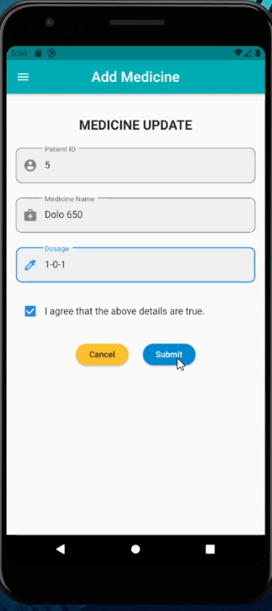

> Form to Add Medicinal Details

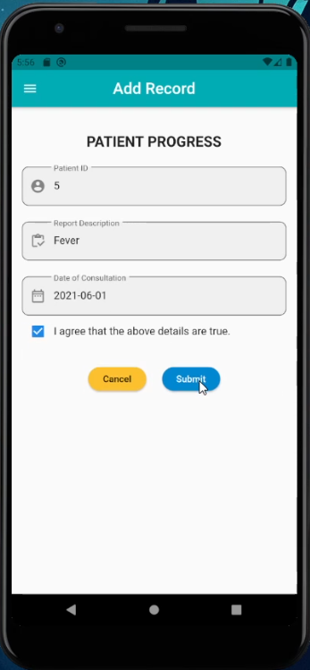

> Form to Add Patient Medical History

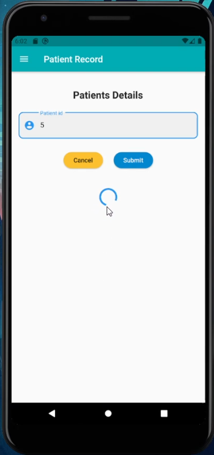

> Form to enter Patient ID to retrieve his detail

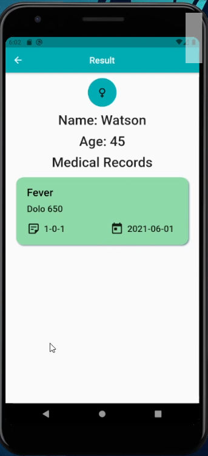

> Result Page

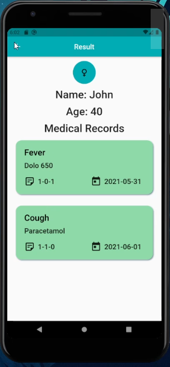

> Multiple Records shown using **ListView Widget**

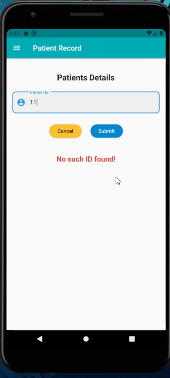

> Error shown when a **non-existent Patient ID** is given

### This Mobile App **_Medic-Chain_** aims to store and retrieve **Patient Medical Records** in a safe, secure and distributed manner using the Block Chain Technology.
